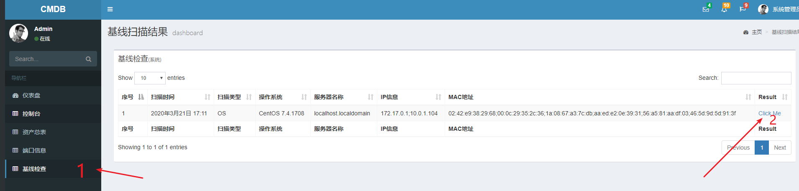
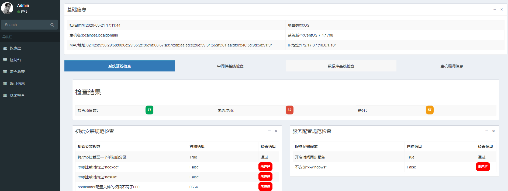
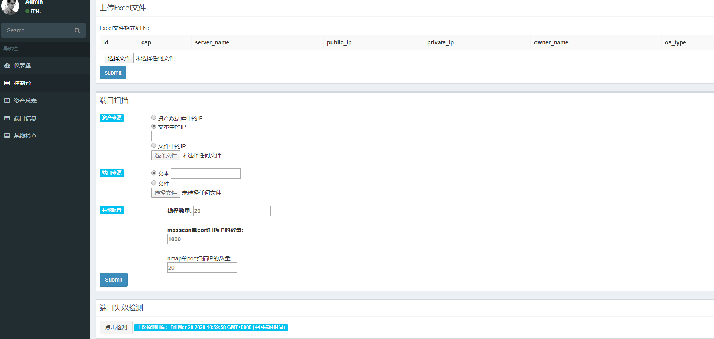
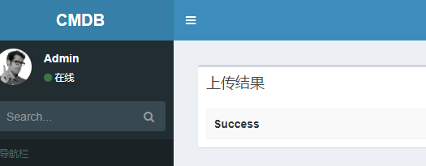
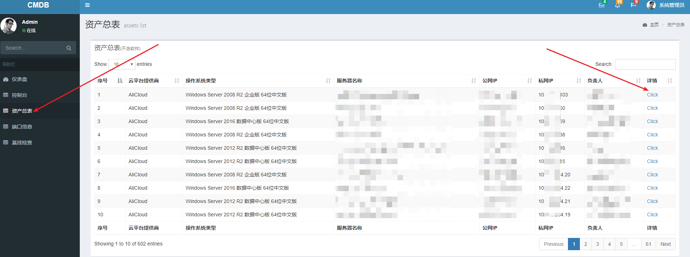
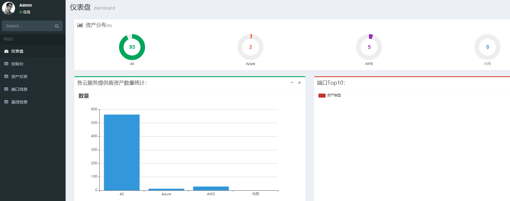
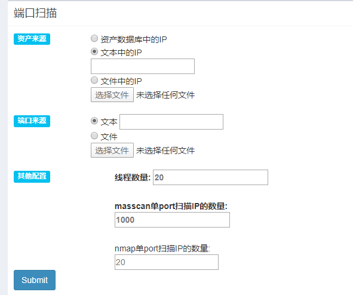

该项目在 https://github.com/feixuelove1009/CMDB 的基础上进行开发

## 0x01 介绍

这是一款服务器的资产管理平台，可以帮助监测云环境上对外开放了哪些端口、开放数量在前十的端口以及对应的服务、检查服务器上的基线情况以及是否具有存在公开EXP的主机漏洞。

## 0x02 版本更新：

- 20191206 AssetManage-v1.0.0
  - 整合多个云上的资产信息
  - 可视化展示
  - 通过excel文件导入资产信息
  - 将nmap扫描后生成的xml文件导入，生成端口信息
- 20200113 AssetManage-v2.0.0
  - 增加基线检查的后端可视化展示界面
- 20200317 AssetManage-v3.0.0
  - 增加基于agent的主机漏洞扫描功能
  - 增加服务器端口开放扫描功能

## 0x03 功能：

- 整合多个云上的资产信息
- 可视化展示
- 通过excel文件导入资产信息
- masscan+nmap快速扫描服务器开放的端口信息
- 基于agent的主机漏洞扫描功能
- 基于agent的基线检查功能

## 0x04 启动服务端

### (一) 手动配置环境

1\. 环境：Kali，python3 (Centos、Ubuntu也可以不过需要自行安装masscan和nmap)

2\. 安装最新版sqlite3

3\. 安装Django==3.0.4

4\. 利用Util下提供的masscan文件夹或自行安装masscan，并软连接到`/usr/local/bin/masscan`

```shell
# Ubuntu
apt-get install git gcc make libpcap-dev clang -y
cd masscan-1.0.5/ && make
ln -s masscan-1.0.5/bin/masscan /usr/local/bin/masscan
```

5\. 利用Util下提供的nmap文件夹或自行安装nmap，并软连接到`/usr/local/bin/nmap`

```shell
# Ubuntu
apt-get install openssl libssl-dev libssh2-1-dev build-essential -y
wget https://nmap.org/dist/nmap-7.80.tar.bz2
tar xf nmap-7.80.tar.bz2 && cd nmap-7.80 && chmod +x ./* && ./configure && make && make install
```

6\. 安装requirements.txt文件中的需求

```shell
python -m pip install -r requirements.txt
```

### (二) 使用docker启动环境

1\. 安装docker

2\. 从仓库中拉取镜像

```shell
docker pull registry.cn-hangzhou.aliyuncs.com/jc0o0l/assetmanage:v3.0.0
```

3\. 运行容器

```shell
docker run -p 8000:8000 --name AssetManage -it registry.cn-hangzhou.aliyuncs.com/jc0o0l/assetmanage:v3.0.0
```

### (三) 使用dockerfile自行创建镜像并运行启动容器

1\. 安装docker

2\. 从Github上下载项目

```shell
git clone github.com/chroblert/assetmanage.git
```

3\. 构建镜像

```shell
cd AssetManage
docker build -t assetmanage:v3.0.0 -f Dockerfile .
# 构建时间大概在1个小时
```

4\. 运行

```shell
docker run -p 8000:8000 --name AssetManage -it assetmanage:v3.0.0
```

## 0x05 使用方式

### (一) 基线检查与主机漏洞扫描

将刚刚启动的服务端的IP记录，并修改Agent目录下的`lilnux_baseline_check.sh`和`win2012_baseline_check.ps1`的文件下面的IP为刚刚的IP

1\. 从AssetManage项目下的Agent目录拖下来并在要检查的服务器中运行里面的文件

> - 里面的`win2012_baseline_check.ps1`用于Windows服务器的基线检查与主机漏洞扫描
>   - 运行：将该脚本在管理员模式下的powershell中运行
> - 其余的文件为Centos系列服务器下扫描用的
>   - 使用：
>     - 为所有的`.sh`文件添加`x`权限：`chmod +x *.sh`
>     - 以管理员权限运行`linux_baseline_check.sh`

2\. 在AssetManage的服务端查看检查结果

- 点击**基线检查**



- 点击**Click**，里面可以查看系统基线检查、Linux中间件检查以及主机漏洞信息

> 注：
>
> - Windows没有中间件检查
>
> - Linux主机漏洞扫描是借助于vulmon的接口实现，不太稳定，需要等待一段时间才会有结果



### (二) 云环境资产管理

1\. 点击**控制台**

- 按照**上传Excel文件**中提供的格式创建文件并填充数据

> csp可以为：AliCloud,AWS,Azure以及其他



- 可以对三种云环境资产进行管理



2\. 点击**资产总表**可以查看资产信息



3\. 点击**仪表盘**可以查看资产的分布



### (三) 服务器开放端口监测

1\. 点击**控制台**

2\. 在**端口扫描**模块中选择一些选项：



> 说明：
>
> - 资产来源：
>
>   - 资产数据库中的IP
>
>     - > 扫描之前导入数据库中的IP
>
>   - 文本中的IP
>
>     - > 以英文逗号分隔每个IP
>
>   - 文件中IP
>
>     - 文件中的格式为：每行一个IP地址
>
> - 端口来源：
>
>   - 文本：
>     - 以英文逗号分隔：例：`1-65535`或者`21,20,80-100`
>   - 文件：
>     - 文件中的格式为：每行一个端口
>
> - 其他配置：
>
>   - 这里面的可以不填，有默认的值

3\. 点击**Submit**按钮并等待扫描完成

> 这里采用多进程多线程运行，所以需要等待一段时间才能看能结果
>
> 扫描时间：以600台为例，进行全端口扫描，根据默认设置，时间在13小时附近

4\. 点击**端口信息**查看端口开放情况

5\. **端口失效检测**

> 更新之前存储在数据库中结果

- 点击**控制台**中的**端口失效检测**


