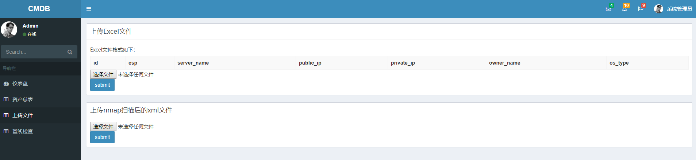

该项目在 https://github.com/feixuelove1009/CMDB 的基础上进行开发

功能：

- 整合多个云上的资产信息
- 可视化展示
- 通过excel文件导入资产信息
- 将`nmap`扫描后生成的`xml`文件导入，生成端口信息
- 安全基线检查结果的展示功能：agent位于`github.com/chroblert/securitybaselinecheck`

使用步骤：

```python
安装最新版sqlite3
python -m pip install requirements.txt
git clone https://github.com/chroblert/AssetManage.git
进入assetMange-master目录
python manage.py makemigrations
python manage.py migrate
python manage.py runserver <ip>:<port>
# 资产管理功能
点击上传文件，选择上传相应的文件
# 安全基线检查结果展示界面
点击基线检查
```

效果图：




