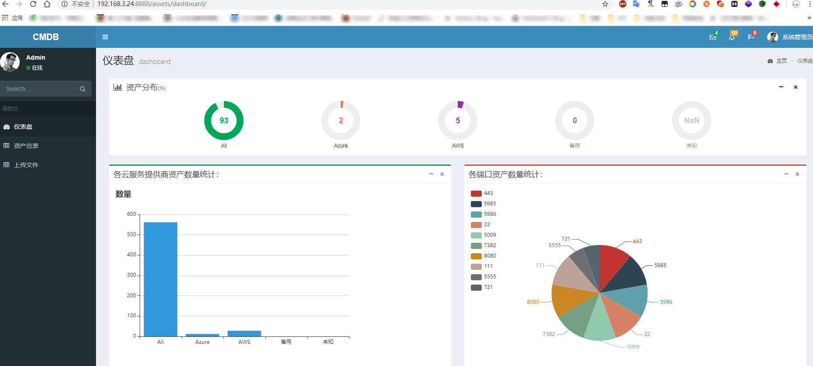
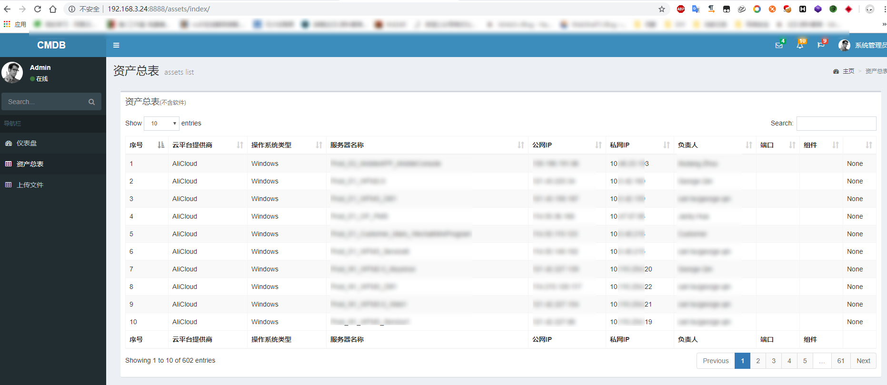
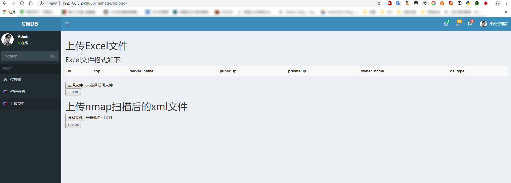

该项目在 https://github.com/feixuelove1009/CMDB 的基础上进行开发

功能：

- 整合多个云上的资产信息
- 可视化展示
- 通过excel文件导入资产信息
- 将nmap扫描后生成的xml文件导入，生成端口信息

使用步骤：

```python
python -m pip install requirements.txt
git clone https://github.com/chroblert/AssetManage.git
进入assetMange-master目录
python manage.py makemigrations
python manage.py migrate
python manage.py runserver <ip>:<port>
```

效果图：







这个上传文件的页面很丑啦///^///


---

